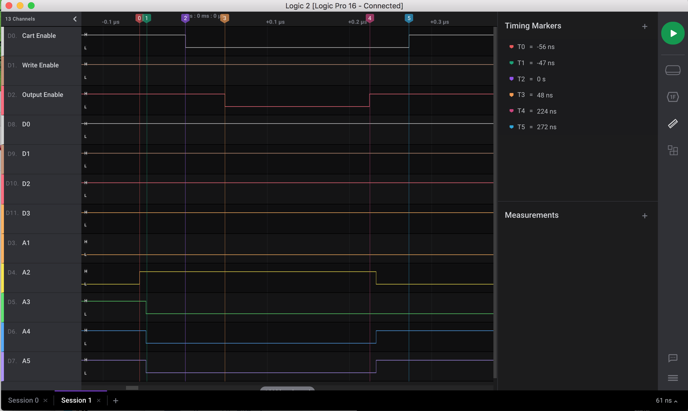
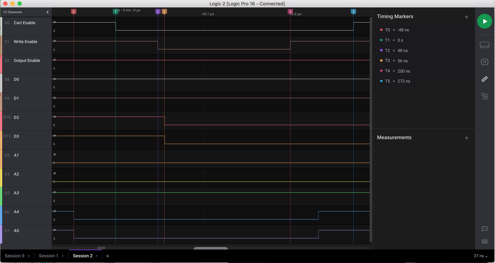

# FX-BMP Port Electrical Information
Technical Information about the PC-FX FX-BMP Memory Card Port

## Card-Edge

### Physical Dimensions

The FX-BMP Cartridge has a double-sided card-edge connector consisting of 50 pins

The card-edge dimensions are:
- PC Board thickness = 0.0625" (1.6mm)
- Width of board = 1.325" (33.65mm)
- Pin spacing is 0.05" (1.27mm)

A near-match card edge connector is made by TE Connectivity, part 5650719-1 ... but the slot is a bit too short;
a dremel tool with the right bit can extend the slot by the needed amount (its slot is 1.310"; this would need to
be extended by about 0.01" on each side, or 0.25mm on each side).

### FX-BMP Card-Edge pinout (on the FX-BMP cartridge)

Orientation:
When looking at the FX-BMP cartridge, the side which looks like the "top" (has the
branding identification) is rotated to face left for insertion into the PC-FX.
The "underside" (which faces right when inserted into the machine) is actually the
side of the PC Board on which the parts are mounted.

This right-facing "underside" also has silkscreen printing identifying a pin
numbering system.  The pin numbered "1" is at the lower-right when inserted into
the PC-FX, and the pin numbered "25" is on the same face, opposite side (upper-right
when inserted into PC-FX).  While there is no printing identifying pins 26 through
50, I will refer to them as numbered in the same way - the reverse-side of the board
from "pin 1" will be "pin 26", and the reverse of "pin 25" will be "pin 50".

### Electrical Signals

Since a relatively common static RAM was used on the board, many of the electrical
signals were possible to be decoded.  However, a CPLD was mounted on the board,
governing many control signals.  As the FX-BMP is battery-backed, the PC-FX can also
detect when the battery level is low, as there is an analog comparator circuit on board,
which gives the CPLD a "good" or "bad" level, which is delivers back to the host system.

5V logic is used for the SRAM and other signals, however the power supply may fall short of the
5V threshold (i.e. 4.5V).

| Description | Pin | Pin | Description |
|-------------|-----|-----|-------------|
| **A26** (to CPLD, pin 12) | **Pin 50** | **Pin 25** | GND|
| **/CartSel** Low if top 5 bits are '11101'/ Hex '0xE8' (to CPLD, pin 10) | **Pin 49** | **Pin 24** |  **A18** (to CPLD, pin 11) |
| No Connection | **Pin 48** | **Pin 23** | **A17** |
| **/WE** | **Pin 47** | **Pin 22** | **A16** |
| GND | **Pin 46** | **Pin 21** | Vdd |
| **/OE** (to CPLD, pin 4) | **Pin 45** | **Pin 20** | Vdd |
| GND | **Pin 44** | **Pin 19** | No Connection |
| GND | **Pin 43** | **Pin 18** | **A15** |
| **A25** (to CPLD, pin 3) | **Pin 42** | **Pin 17** | **A14** |
| **A23** (No Connection inside cart) | **Pin 41** | **Pin 16** | **A13** |
| **A22** (No Connection inside cart) | **Pin 40** | **Pin 15** | **A12** |
| GND | **Pin 39** | **Pin 14** | **A11** |
| **A21** (No Connection inside cart) | **Pin 38** | **Pin 13** | **A10** |
| **A20** (No Connection inside cart) | **Pin 37** | **Pin 12** | **A9** |
| **A19** (to CPLD, pin 2) | **Pin 36** | **Pin 11** | Vdd |
| GND | **Pin 35** | **Pin 10** | Vdd |
| **D7** | **Pin 34** | **Pin 9** | **A8** |
| **D6** | **Pin 33** | **Pin 8** | **A7** |
| **D5** | **Pin 32** | **Pin 7** | **A6** |
| **D4** | **Pin 31** | **Pin 6** | **A5** |
| **D3** | **Pin 30** | **Pin 5** | **A4** |
| **D2** | **Pin 29** | **Pin 4** | **A3** |
| **D1** | **Pin 28** | **Pin 3** | **A2** |
| **D0** (to CPLD pin 1) | **Pin 27** | **Pin 2** | **A1** (no A0; data is every second address) |
| GND | **Pin 26** | **Pin 1** | GND |

Note: While GND at pins #1, 25, 26 appear to be ground plane, the other grounds may
be signals fed back to the PC-FX (such as "cart inserted").

Also note that /OE and /WE signals are identifiable for their distinctly shorter durations as compared to
the regular address lines:
 - On a write cycle, /WE is ~150ns, whereas address lines are in place for ~270ns
 - On a read cycle, /OE is ~190ns, and regular address lines are in place for ~410ns

## Signal Timing

The FX-BMP Port is essentially a memory-access port for external memory and memory-mapped devices.
The /CARTSEL signal is triggered when memory accesses in the range 0xE8000000-0xEFFFFFFF are accessed.
Based on signal captures, accesses to this port are slowed down to half of the regular clock speed; additionally,
access to this port is intended to be byte-width (address line A0 is not presented to the bus).

While the FX-BMP uses 70ns static RAM, the signal capture implies that the memory could be substantially slower
than that, and still be effective.

### Data Read Capture

### Data Write Capture

## CPLD on the FX-BMP cart:

### Functionality

This chip does some address-decode duties, as well as presents "low battery" information onto the bus.

**For address-decode:**\
0xE8000000 - 0xE9FFFFFF is used for RAM (decode /CartSel, A26, A25 as '0'; only bring /OE low if all are low)\
0xEA000000 - 0xEBFFFFFF is used for battery status reporting

**For battery-status reporting:**\
If the battery voltage dips below a specific threshold level, a '0' will be output on data line 0 (D0) in the
battery status reporting range.  In other words, reading memory location 0xEA000000 should provide a 0xFE for
low/bad battery; and 0xFF if the battery is OK.

### Chip Information

Markings on CPLD (QFP-52 package):
NEC JAPAN
D65612GC114
9621EP002

Appears to be 1.2K-gate (~800 usable gates) CPLD from NEC's CMOS-6X 1.0-micron Gate Array family

### Bus connections:

| Pin | Description |
|-----|-------------|
| Pin 1 | Bus Pin 27 (D0) |
| Pin 2 | Bus Pin 36 (A19) |
| Pin 3 | Bus Pin 42 (A25) |
| Pin 4 | Bus Pin 45 (/OE) |
| Pin 5 |  |
| Pin 6 | Vdd |
| Pin 7 | GND |
| Pin 8 |  |
| Pin 9 | GND |
| Pin 10 | Bus Pin 49 (/CartSel) |
| Pin 11 | Bus Pin 24 (A18) |
| Pin 12 | Bus Pin 50 (A26) |
| Pin 13 |  |
| Pin 14 |  |
| Pin 15 | To SRAM pin 24 /OE |
| Pin 16 |  |
| Pin 17 | GND |
| Pin 18 |  |
| Pin 19 | GND |
| Pin 20 |  |
| Pin 21 | GND |
| Pin 22 | Vdd |
| Pin 23 | (voltage sense ?) |
| Pin 24 |  |
| Pin 25 |  |
| Pin 26 |  |
| Pin 27 |  |
| Pin 28 |  |
| Pin 29 |  |
| Pin 30 |  |
| Pin 31 | GND |
| Pin 32 |  |
| Pin 33 | GND |
| Pin 34 | Vdd |
| Pin 35 | appears to be NC |
| Pin 36 | appears to be NC |
| Pin 37 | appears to be NC |
| Pin 38 | appears to be NC |
| Pin 39 | appears to be NC |
| Pin 40 | appears to be NC |
| Pin 41 | appears to be NC |
| Pin 42 | appears to be NC |
| Pin 43 | appears to be NC |
| Pin 44 | appears to be NC |
| Pin 45 | Vdd |
| Pin 46 | appears to be NC |
| Pin 47 | appears to be NC |
| Pin 48 | GND |
| Pin 49 | appears to be NC |
| Pin 50 | appears to be NC |
| Pin 51 | appears to be NC |
| Pin 52 | appears to be NC |

I/O pins from pin 35 to 52 appear not to be used... (only power)

### Notes on Internal Configuration

1. The key output from the CPLD (other than the bettery-sense), is the /OE signal.  The /OE signal is triggered
through the range 0xE8000000 - 0xE9FFFFFF uniformaly.  This is derived by:
   - Default value of /OE is high, except if all of the following are true:
   - /CartSel is low
   - A26 is low
   - A25 is low
   - /OE is low

2. The CPLD is already programmed to deal with larger-size FX-BMP cartridges, as the CPLD also takes A18 and A19
as input, and the fact there are jumpers on the FX-BMP circuit board.  Instructions on how to upgrade a FX-BMP
cartridge to 512KB can be found here:
[Upgrade Instructions](../FX-BMP_Upgrade.md)

