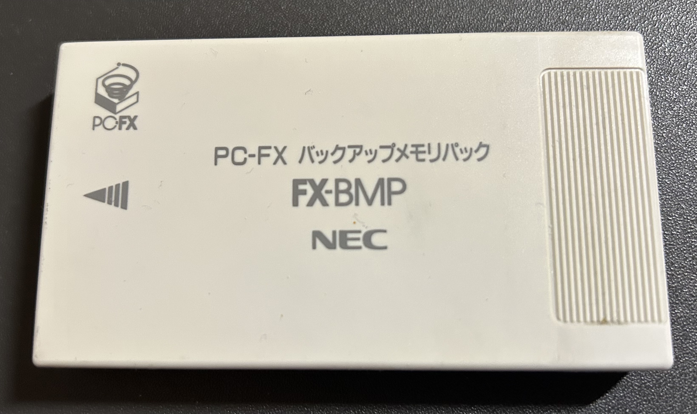

# FX-BMP Information
Technical Information about the PC-FX FX-BMP Memory Card

## Cartridge

The PC-FX had both 32KB of game memory storage available internal to the console, as well as an expansion port for FX-BMP
external memory cards for expandable storage.  Some games can directly support the FX-BMP memory, but most don't support this.
However, the system firmware contains a memory-management subsystem for copying/moving between these.

The FX-BMP cartridges sold during the system's lifetime were built to hold 128KB of data, but the system was designed to allow
for cartridges up to 2MB in size.  The developer documentation makes specific reference to these sizes, but after the cartridge port
was mapped out and FX-BMP behaviour was understood, a 2MB test cartridge was built to verify that the BIOS formatted the cartridge
correctly for memory of this size.

Both the internal memory and the FX-BMP are formatted by the system firmware to contain a filesystem based on FAT12 (or FAT16 for
1MB and 2MB carts).  The system can also boot software from the FX-BMP port, if it contains the correct boot information.

More information regarding the internal format can be found in the [FX_Backup_Mem_Format.md](FX_Backup_Mem_Format.md) file in this repository.

## Memory Usage by Game

Notes on the amount of memory used by each game can be found in the [FX_Backup_Mem_Use.md](FX_Backup_Mem_Use.md) file in this repository.

## Physical and Electrical Characteristics

Detailed notes on the physical and electircal characteristics can be found in the [FX_Cart_Electrical.md](FX_Cart_Electrical.md) file in this repository.

## Upgrading a FX-BMP from 128KB to 512KB

Instructions on how to upgrade a  FX-BMP cartridge to 512KB can be found here:
[Upgrade Instructions](../FX-BMP_Upgrade.md)

