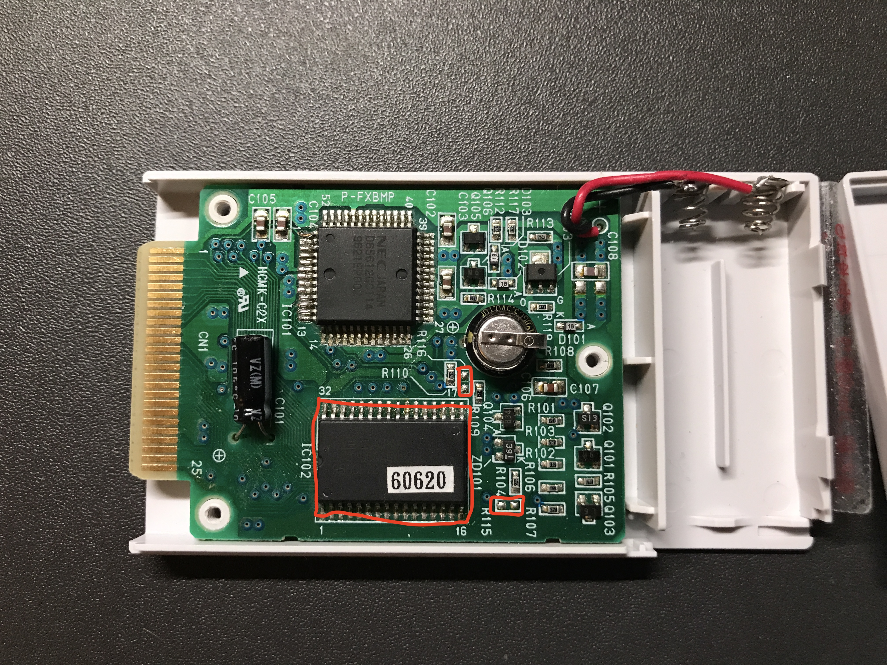

# FX-BMP_Upgrade

How to upgrade an FX-BMP from 128KB to 512KB

### Background

The FX-BMP was only sold in a 128KB configuration during the system's lifetime, but examination
of the PC-FXGA developer documents indicate that they had planned for the capability of the following
additional sizes:
 - 256KB
 - 512KB
 - 1MB
 - 2MB
 - 4MB
 - 8MB

This section will describe how to upgrade a normal 128KB FX-BMP cartridge to 512KB.

### Integrated Circuit Chips

The FX-BMP has several chips in it, but the key chip for storage is the UPD431000AGW-70L chip, which
is a 5V Static RAM with 70ns access time, in a SOP-32 package.

As time goes by, it is getting more difficult to obtain 5V chips, but access speeds and memory sizes
have improved - faster/larger chips have come down in price and become 'standard'.  For this reason,
there isn't much difference in price between a 128KB and 512KB 5V SRAM chip, and 55ns access time
is more common than 70ns these days.

Standard 128KB and 512KB SRAM chips in the SOP-32 package have very similar pinouts, with 2 extra
address lines on the 512KB SRAM.

One more important consideration in choosing a replacement SRAM chip is the standby mode power
consumption, because the module is battery-backed, and is expected to retain its memory for a long
time on a single set of batteries.

The UPD431000AGW-70L chip has a standby power consumption of 13uA, but only 3uA in "data retention mode".

With all these factors in mind, the AS6C4008-55SIN by Alliance is a suitable replacement.
This chip is 512KB, is also a 5V chip, has access time of 55ns, and has standby current consumption of
4uA and data retention power consumption of 2uA (typical).

### Details on the Upgrade Itself

Only 3 parts are required for the upgrade:
 - 1 Static RAM chip AS6C4008-55SIN (This can be bought at Mouser Electronics, as part number
913-AS6C4008-55SIN for roughly $6US)
 - 2 jumpers - these are ideally 0603-size 0-ohm surface-mount resistors (0805 can also work)

The picture below illustrates where these components are on the PC board.
(I won't go into details about how soldering techniques for surface-mount electronics; there should
be sufficient advice on the subject elsewhere on the internet.)

**STEP 1: Open Case**
 - Open the FX-BMP case by removing the screws.
 - Remove batteries and the battery holder lid.
 - Carefully open the plastic case to expose the circuit board, keeping the side with mounted parts facing up

**STEP 2: Remove Old SRAM**
 - Desolder the Static RAM.  If you are using a hot air gun for this, separate the PC board from the plastic
case, to keep it from melting, and cover the other parts with kapton tape to keep them from being dislodged.
I used a soldering iron, and bent pins one by one.

**STEP 3: Clean Pads**
 - Use a solder wick to remove excess solder from the pads - from both the SRAM chip, as well as the jumper
locations.
 - Clean the areas to be soldered with flux cleaner or isopropyl alcohol

**STEP 4: Mount Jumpers**
 - These should be mounted before the SRAM chip, as there is better access to these tight areas when the
SRAM chip is not here.
 - Use flux to ensure soldering is easier and creates better joints.

**STEP 5: Mount SRAM**
 - Check that the chip is oriented in the correct direction before soldering.
 - Use flux to ensure good joints
 - Check for good contacts, and ensure there are no shorts between pins.

**STEP 6: Test**
 - When you are ready to test, close the case (perhaps tape it shut in case you need to go back inside to fix
something).  The tes is best-executed with good batteries loaded into the cart, and the lid closed.
 - Insert it into the PC-FX, and power the machine on
 - Go to the backup Memory Management screen (bottom left), select "cart", and then "format".
 - Power the machine off. You may wish to remove the FX-BMP cartridge from the machine and wait a few minutes,
to test retention.
 - With the cart in the machine, power on and go back to the backup memory management screen, slecting "cart".
 - The data is retained if, beside the format option, there is another available icon (looks like a notebook).
 - The FX-BMP is now ready for use... but 512KB is a lot of space, so you may never fill it up completely...

Diagram below, indicating location of the SRAM chip and the jumpers:

