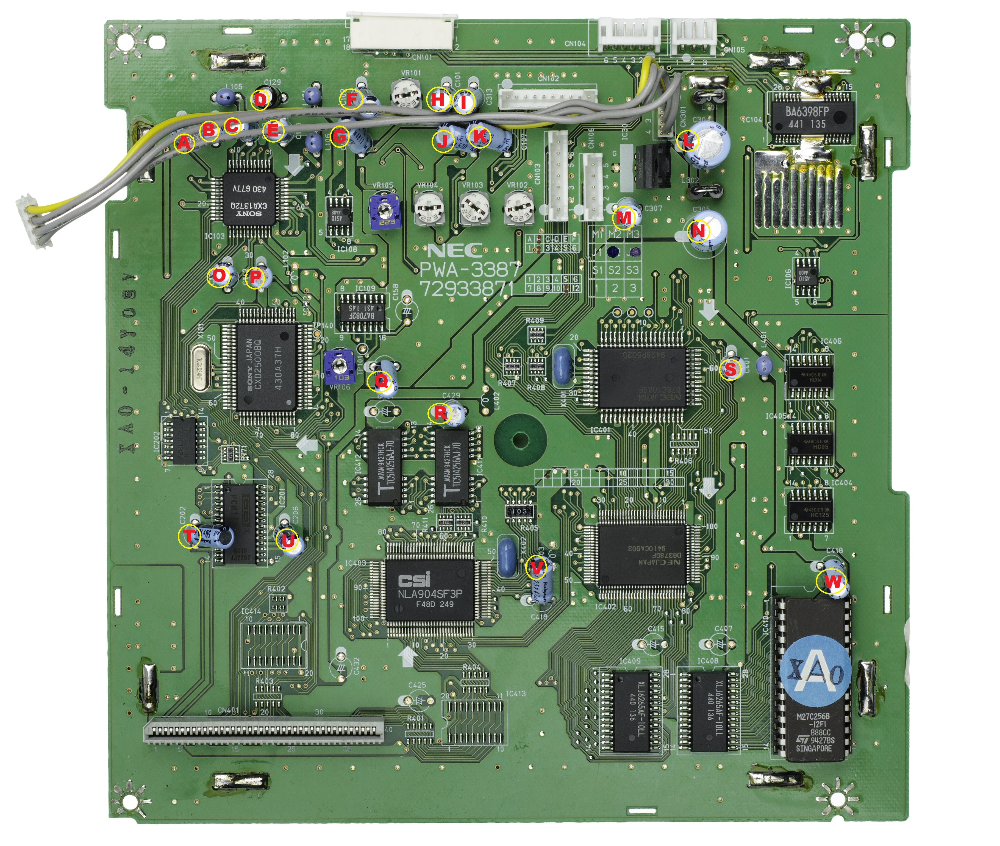

# PC-FX_Capacitor Chart
Capacitor Charts for the PC-FX

## Daughterboard

The daughterboard is involved in the control of the CDROM device, the transfer of data from that device, and
the production of audio based on the output from the CDROM.  The capacitors on this board can be very important
for these reasons.

I understand that there may be multiple versions of this daughterboard; however, the image at
Wikimedia commons matched my own board, so I annotated that image.

The original image for the daughterboard was taken from Wikimedia Commons, here:
[Wikimedia Image](https://commons.wikimedia.org/wiki/File:NEC-PC-FX-Daughterboard-Flat.jpg)

### Capacitors

| Identifier in diagram | Value and Rating |
|-----|-------------|
| D | 1uF, 50V |
| C | 3.3uF, 50V |
| Q | 4.7uF, 50V |
| A, J, K, T, U | 10uF, 50V |
| B, E | 22uF, 25V |
| H, P, R, V, W | 47uF, 25V |
| O | 47uF, 50V |
| F, G, I, M, S | 100uF, 10V |
| N | 470uF, 6.3V |
| L | 470uF, 16V |
