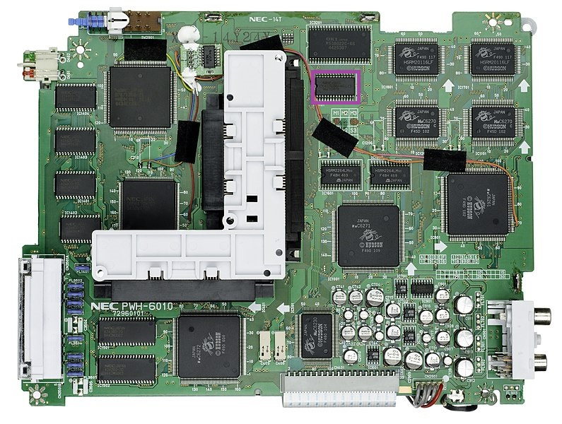
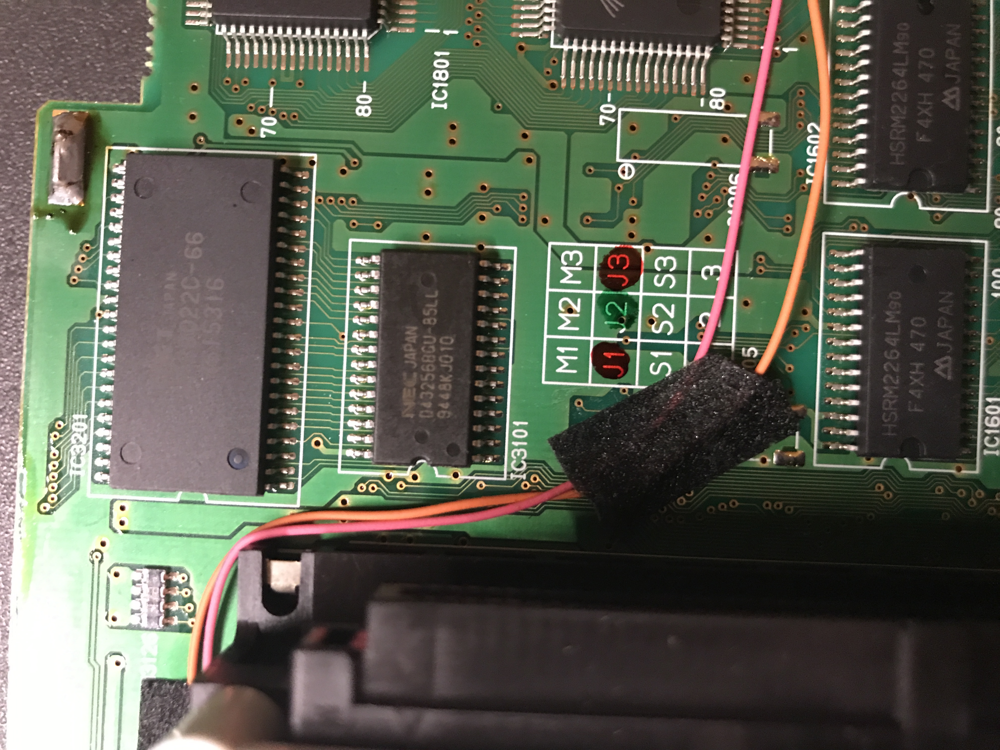
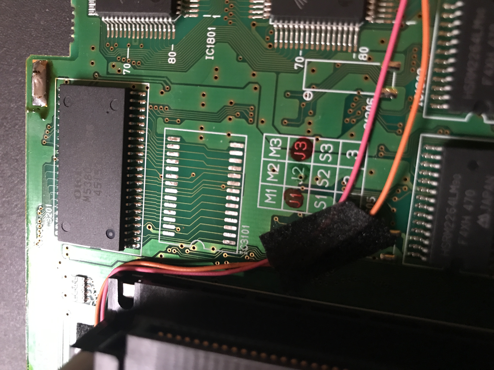
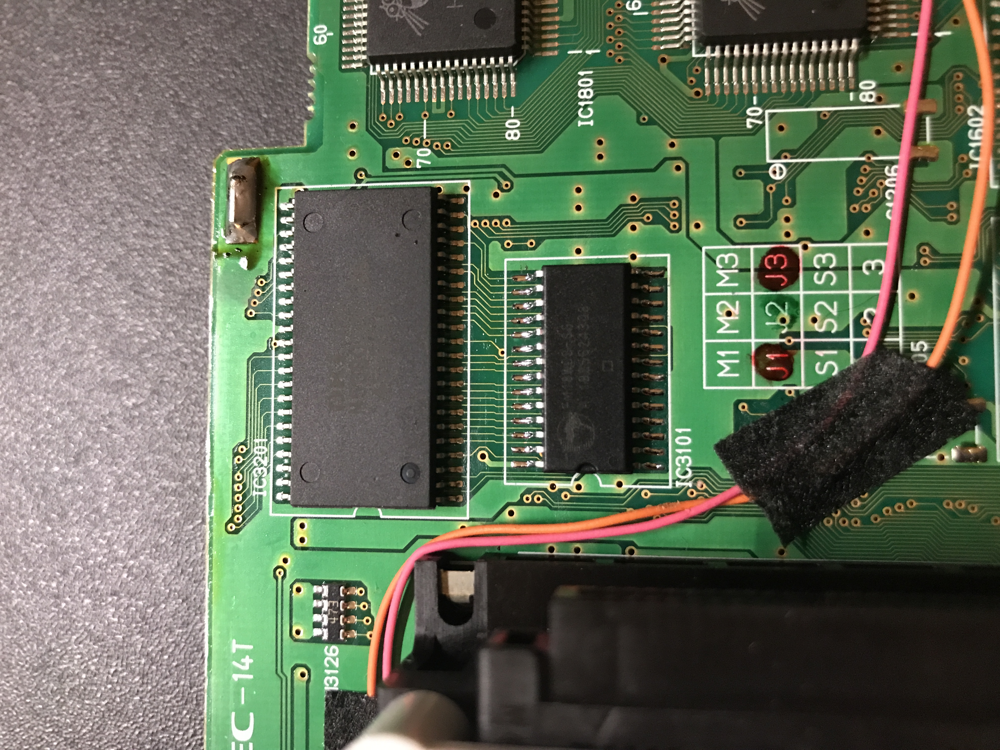

# Internal_FRAM_Upgrade

How to upgrade the internal save game memory of a PC-FX from SRAM (backed by supercapacitor) to non-volatile FRAM.

### Background

The PC-FX contained 32KB of internal backup memory for game saves. This was backed by supercapacitor, but if the
system was turned off for extended periods, the internal memory could lose its contents.

It's unclear as to whether keeping it plugged in (but staying off) makes any difference - the power supply is
complex enough that it might have some circuitry to trickle electricity into the SRAM chip to keep the contents
fresh, I don't know... but I've personally always unplugged the machine for periods, and come back to find
unformatted internal memory.

This section will describe how to upgrade a normal 32KB SRAM PC-FX to non-volatile FRAM.

### Integrated Circuit Chips

The PC-FX has many chips in it; the key chip for game saves is the UPD43256-70L chip, which is a 5V,
32Kx8 Static RAM in a SOP-28 package.

The replacement chip is a 5V, 32Kx8 FRAM (Ferro-electric RAM, which is non-volatile), which comes in
the same SOP-28 package, and is even pin-compatible - so there are no additional wires to solder, only
a chip-for-chip replacement !

### Details on the Upgrade Itself

First, familiarize yourself with the teardown instructions on iFixit, here:
[iFixit Teardown instructions](https://www.ifixit.com/Teardown/NEC+PC-FX+Teardown/148628)

This system is complicated to disassemble and reassemble, so don't start unless you're very confident
that you can finish the job.

Only 1 part is required for the upgrade:
 - 1 FRAM chip FM18W08-SG (or -SGTR) (This can be bought at Mouser Electronics, as part number 913-AS6C4008-55SIN for roughly $13)

**STEP 1: Backup Contents**

Since this process will remove the actual chip holding any of your savegames, you should backup any
important information before you start.  You can copy game saves from the internal storage to a FX-BMP
in order to preserve them.

Or, if you don't care about any files on your system (perhaps you were motivated to do this modification because
you just lost your important savegames...), you can just proceed with the modification.

**STEP 2: Open Case and Get Motherboard**

I'm not going to explain the whole disassembly process; simply follow the directions in the iFixit Teardown
document until you have the motherboard removed, and continue following the directions below.

The picture below illustrates where these components are on the PC board.
(I won't go into details about how soldering techniques for surface-mount electronics; there should
be sufficient advice on the subject elsewhere on the internet.)

**STEP 3: Remove Old SRAM**
 - First, you may need to move a couple of wires away from the chip; there are a couple of wires which were
installed at the factory, which are taped to the motherboard in the vicinity of the SRAM. If they are too
close, gently lift the tape, shift the wires to a better location, and re-tape them to the motherboard there.
 - Desolder the Static RAM.  If you are using a hot air gun for this, be VERY careful, as there are a lot
of other parts in the area, including pastic sockets.  

I used a soldering iron and solder wick, and eventually bent pins one by one.\
On my board, the SRAM chip was not epoxied to the board - although some surface-mount factories in this era
did use epoxy (notably on Sega Saturns). If the chip is epoxied to the board, it is more difficult to remove
once the pins are desoldered (but that shouldn't be the case for the PC-FX).

**STEP 4: Clean Pads**
 - Use a solder wick to remove excess solder from the pads which were under the SRAM chip
 - Clean the areas to be soldered with flux cleaner or isopropyl alcohol

**STEP 5: Mount FRAM**
 - Check that the chip is oriented in the correct direction before soldering.
 - Use flux to ensure good joints
 - Check for good contacts, and ensure there are no shorts between pins.

**STEP 6: Test**
 - When you are ready to test, reassemble the system (referencing the iFixit guide).
 - Power the machine on
 - Go to the backup Memory Management screen (bottom left), select "system", and then "format".
 - Power the machine off and wait a few minutes, to test retention.
 - Power on and go back to the backup memory management screen.
 - The data is retained if, beside the format option, there is another available icon (looks like a notebook).

Diagram below, indicating location of the SRAM chip:

Close-up of area before upgrade:

Close-up of area after SRAM chip removed:

Close-up of area after upgrade:

